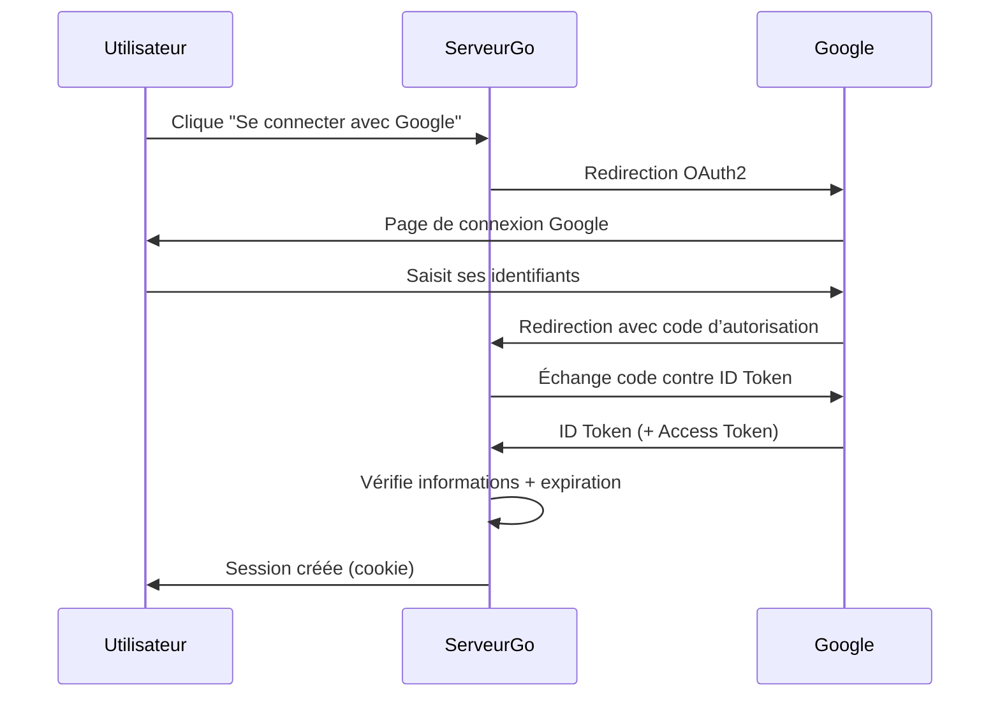
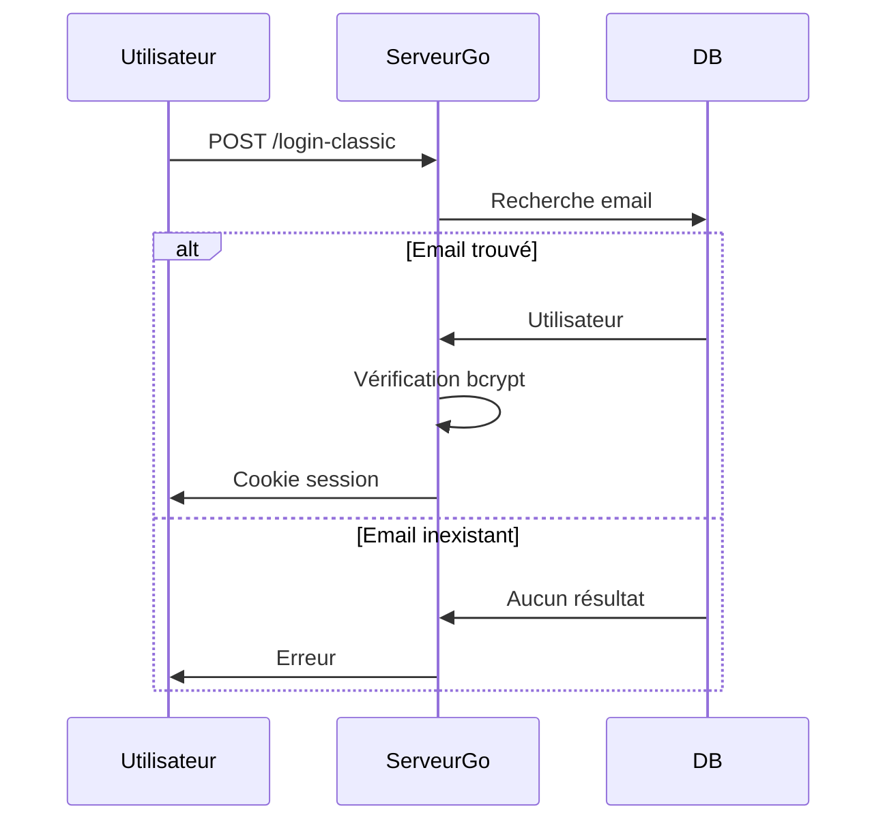
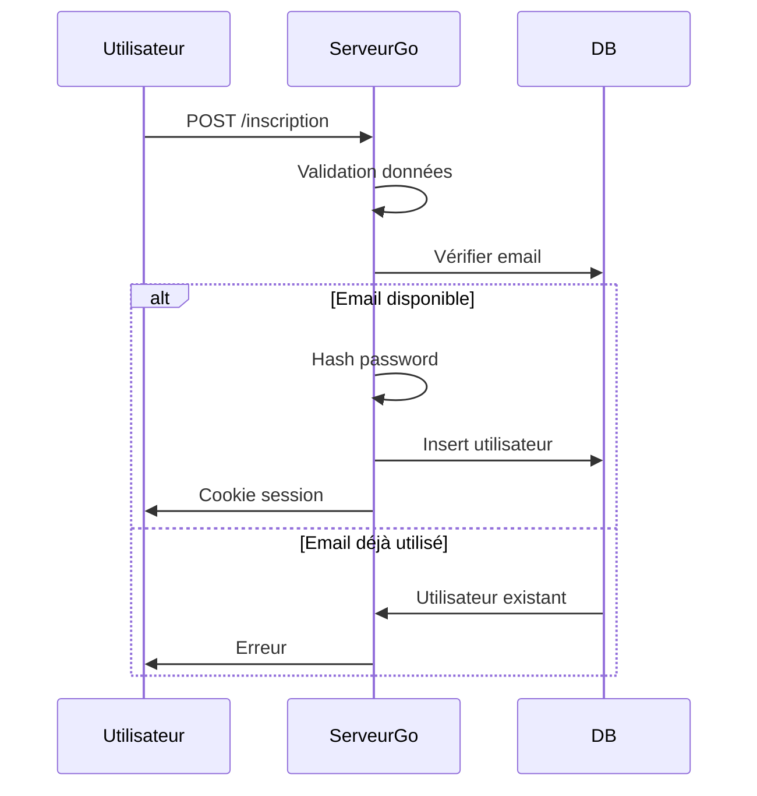
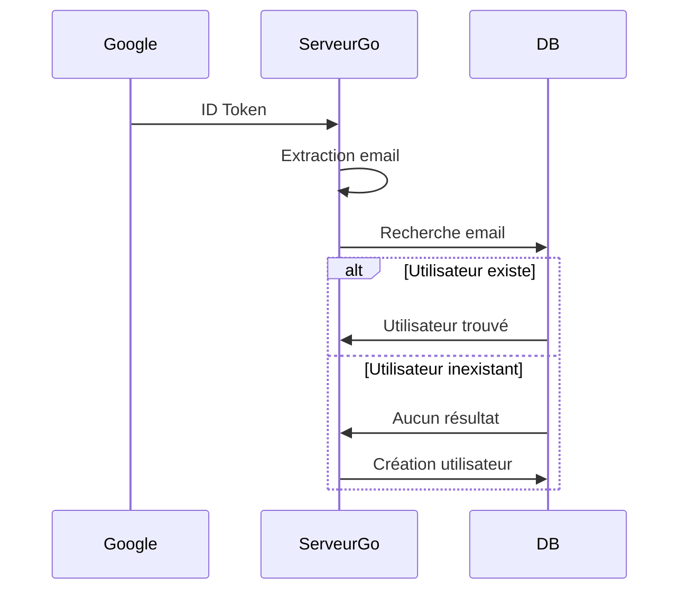

# Diagramme de séquence

## 1 - Développement d’un serveur web en Go

Développement d’un serveur web en Go :

avec des routes publiques :
  * `/` -> page de connexion
  * `/inscription` -> création de compte (email, nom, mdp ...)
  * `/login` -> connexion Google
  * `/login-classic` -> connexion email + mdp
  * `/callback` -> retour Google

avec des routes protégées :
  * `/secret` -> on peut y accéder que si connecté (`requireLogin(...)`)

=> logique d’authentification :
  * cookies (nommés session)
  * mdp (hashé avec bcrypt)
  * vérification email + password \
  ou
  * authentification via Google (cookie aussi mais on peut oenlever et laisser ceux de google)

une base SQLite pour stocker les utilisateurs :
  * nom
  * prénom
  * email (unique)
  * mdp hashé

## 2 - Intégration d’OpenID Connect

Intégration d'un système d’authentification basé sur OpenID Connect (OIDC) avec Google.

OpenID Connect : protocole d'identité basé sur OAuth2.

* OAuth 2.0 -> protocole d'autorisation
* OIDC -> protocole d’authentification d’identité

OIDC est une couche d’identité construite au-dessus d’OAuth2.
Elle permet à une application de déléguer la connexion utilisateur à un Identity Provider comme Google.

Dans mon projet, OIDC sert à :
* rediriger l’utilisateur vers Google
* récupérer un ID token signé
* vérifier la signature et la validité
* extraire l’adresse email
* connecter ou créer l’utilisateur

## 3 - Authentification Google (Identity Provider)

Configuration de Google comme Identity Provider OpenID Connect.

## 4 - Authentification classique (email + mot de passe)

L’utilisateur peut aussi saisir son email + son mdp puis cliquer sur "Se connecter"

Le serveur :
* recherche l’utilisateur par email dans la bdd
* compare le mot de passe avec bcrypt
* crée une session si valide

## 5 - Inscription

L’utilisateur peut cliquer sur "S’inscrire".

Il remplit :
* Nom
* Prénom
* Email
* Mot de passe
* Confirmation mot de passe

Le serveur :
* valide les champs (ex : nb charactères mdp > 6)
* vérifie que l’email n’existe pas déjà
* hash le mot de passe (bcrypt)
* enregistre dans la bdd
* crée une session (cookie nommée session => expiration 20s)

## 6 - Matching de compte avec l’adresse email

Pour Google :

Le matching se fait uniquement sur l’email.

## 7 - Stockage des utilisateurs dans SQLite

Utilisation de SQLite via GORM pour stocker :
gorm => orm de go (pour communiquer avec un bdd)
* ID
* Nom
* Prénom
* Email (unique)
* Password (hash bcrypt)

## 8 - Conteneurisation avec Docker

Création d’une image Docker contenant :
* dépendances
* base SQLite
* application exposée sur le port 8080

## 9 - Déploiement dans Kubernetes

Déploiement sur un cluster Kubernetes (ex : Minikube)

Deployment :
* lance le pod
* redémarre si crash
* gère les mises à jour

Service :
* expose l’application
* fournit une IP stable
* redirige le trafic vers le pod

Application accessible via navigateur.

## 10 - Tests automatisés du front web

Utilisation de Playwright pour tester :
  * page login
  * inscription
  * connexion classique
  * connexion Google

